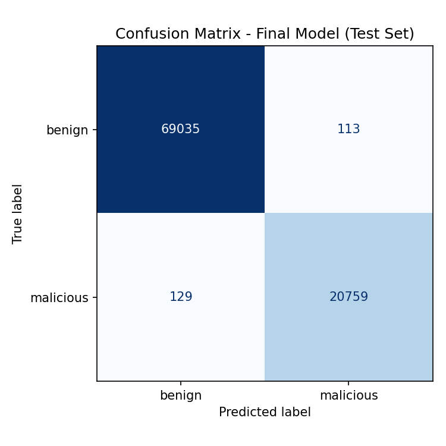
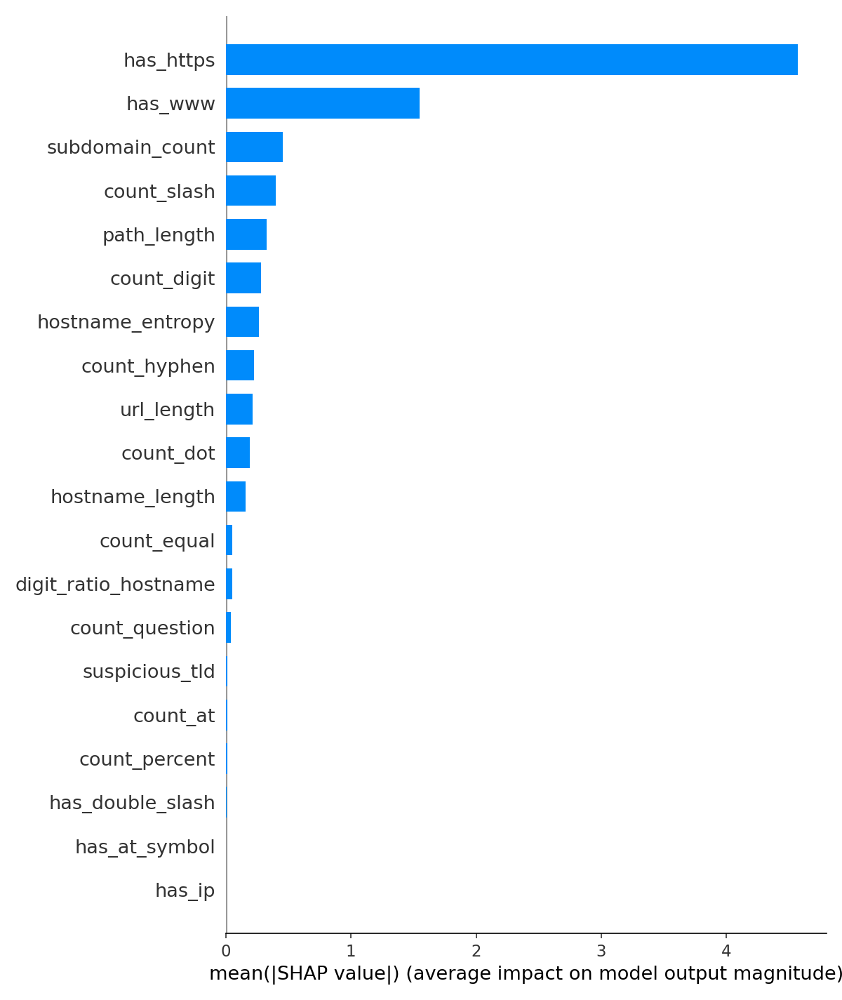

#  Phishing URL Detector

**🔗 Canlı demo: [phishing-url-detector-cutsfretd7lgocwsvv7yvf.streamlit.app](https://phishing-url-detector-cutsfretd7lgocwsvv7yvf.streamlit.app)**

Bir URL'nin sadece metinsel (lexical) özelliklerine bakarak phishing/malicious
olup olmadığını tahmin eden bir makine öğrenmesi projesi. Kaggle'daki
[Malicious and Benign URLs](https://www.kaggle.com/datasets/siddharthkumar25/malicious-and-benign-urls)
veri seti (450K+ URL) üzerinde eğitildi.

>  **Sınırlama:** Model yalnızca URL string'ine bakar; WHOIS, SSL sertifikası,
> DNS kaydı veya sayfa içeriği gibi bilgileri kullanmaz. Bu nedenle tek başına
> production-grade bir güvenlik kararı için yeterli değildir — bkz. "Bilinen
> Sınırlamalar" bölümü.

## Proje Yapısı

```
├── src/features.py      # Tek kaynak feature extraction (train + serve ortak kullanır)
├── train.py              # CV + class imbalance + hyperparameter tuning + SHAP
├── app/app.py             # Streamlit deployment arayüzü
├── models/                # Eğitilmiş model (.pkl) — train.py sonrası oluşur
├── reports/                # metrics.json, confusion_matrix.png, shap_*.png
└── requirements.txt
```

## Yaklaşım

1. **Feature engineering** — başlangıçta 20 lexical özellik tasarlandı (URL/hostname/path
   uzunluğu, özel karakter sayıları, IP kullanımı, subdomain sayısı, hostname entropy'si,
   şüpheli TLD bayrağı, `has_www`, `has_https`). Test aşamasında `has_www` ve `has_https`'in
   veri setine özgü bir önyargı taşıdığı bulunup çıkarıldı (bkz. "Kritik Bulgu" bölümü) —
   **final model 18 feature kullanıyor.**
2. **Model seçimi** — Logistic Regression, Random Forest ve XGBoost,
   Stratified 5-Fold cross-validation ile karşılaştırıldı (tek train/test
   split yerine).
3. **Class imbalance** — veri setinde benign:malicious oranı yaklaşık 3.3:1.
   `class_weight="balanced"` (LogReg/RF) ve `scale_pos_weight` (XGBoost) ile
   ele alındı.
4. **Hyperparameter tuning** — XGBoost için `RandomizedSearchCV` (ROC-AUC
   optimizasyonu).
5. **Explainability** — SHAP ile global feature importance ve örnek bazlı
   açıklama (`reports/shap_*.png`).
6. **Değerlendirme** — Test seti üzerinde ROC-AUC, precision/recall/F1 ve
   confusion matrix; false negative (kaçırılan phishing) ile false positive
   (yanlış bloklanan güvenli site) arasındaki maliyet farkı ayrıca yorumlandı.
7. **Fairness testi ve düzeltme** — manuel testte modelin `www.` önekine karşı
   tutarsız davrandığı bulundu, kök nedeni izole edilip düzeltildi (detaylar aşağıda).

## Kritik Bulgu: `www.` Önyargısı ve Düzeltmesi

Manuel testte, modelin (ilk versiyonda) `www.` önekine göre **tutarsız** tahminler
verdiği bulundu — aynı domain'in `www.`'lı ve `www.`'sız hali tamamen zıt sonuç veriyordu:

| URL | İlk model | Düzeltme sonrası |
|---|---|---|
| `github.com` | 🔴 %98.0 malicious | 🟢 %13.9 benign |
| `www.github.com` | 🟢 %1.0 benign | 🟢 %13.9 benign *(tutarlı)* |
| `openai.com` | 🔴 %97.4 malicious | 🟢 %13.4 benign |
| `www.openai.com` | 🟢 %1.0 benign | 🟢 %13.4 benign *(tutarlı)* |

**Kök neden:** Kaggle veri setinde `www.` önekinin benign/malicious dağılımı orantısız
(muhtemelen veri toplama yöntemine özgü bir artefakt, gerçek bir phishing sinyali değil).
Model bu korelasyonu doğrudan (`has_www` feature'ı) ve dolaylı olarak (uzunluk/nokta-sayma
feature'ları `www.` eklenince otomatik değişiyor) iki kanaldan da öğrenmişti.

**Denenen düzeltmeler:**
1. Uzunluk/sayma bazlı feature'ları `www.` önekinden bağımsız (normalize edilmiş
   hostname üzerinden) hesaplamak — dolaylı sızıntıyı kapattı ama `has_www` feature'ının
   kendisi hâlâ ham korelasyonu taşıyordu.
2. `has_www` ve `has_https`'i feature setinden tamamen çıkarmak — bunu çözdü, ancak
   test AUC'sini 0.9993'ten 0.9587'ye düşürdü.

**Karar:** İkinci seçenek (feature'ları çıkarmak) benimsendi. Sebep: 12 gerçek/modern
site + phishing örneğinden oluşan elle test edilen bir sette, düzeltilmiş model daha az
hata yaptı (12'de 2) orijinal modele göre (12'de 4) — çünkü test setindeki genel F1
istatistiği de aynı `www.` önyargısını taşıyan bir dağılımdan geliyor ve gerçek dünya
performansını olduğundan iyi gösteriyordu. Modern siteler (GitHub, Netflix, OpenAI, Stack
Overflow vb.) artık `www.` kullanmadığından, bu düzeltme pratikte daha güvenilir bir
model üretiyor — ölçülen agregat metrik düşse bile.

## Sonuçlar

Kaggle'daki tam veri seti (450K+ URL, benign:malicious ≈ 3.3:1) üzerinde eğitildi.
Aşağıdaki sayılar **`www.`/`https` düzeltmesi sonrası final model** için geçerli.

| Model | CV ROC-AUC (5-fold, mean ± std) |
|---|---|
| Logistic Regression | 0.9979 ± 0.0002 |
| Random Forest | 0.9984 ± 0.0002 |
| XGBoost (20 feature, düzeltme öncesi) | 0.9989 ± 0.0001 |
| **XGBoost (18 feature, final model)** | **0.9591 ± 0.0006** |

**Final model — test seti (90.036 örnek):**

| Metrik | Değer |
|---|---|
| ROC-AUC | 0.9587 |
| Precision (malicious) | 0.7145 |
| Recall (malicious) | 0.8891 |
| F1-score | 0.7923 |
| False Positive Rate | %10.73 |
| False Negative Rate | %11.09 |

Confusion matrix: TN=61.726, FP=7.422, FN=2.316, TP=18.572.

Bu sayılar, önyargı taşıyan 20-feature modelin (F1 0.9942) çok altında — bilinçli bir
trade-off. Elle yapılan gerçekçi testler, agregat metriklerin ima ettiğinden daha iyi bir
pratik performansa işaret ediyor, ama bu resmi olarak ölçülmedi (yalnızca 12 örneklik
manuel bir karşılaştırma). **Bu proje, "en yüksek skor" yerine "test edilmiş, dürüstçe
belgelenmiş trade-off" tercih edildiğinin bir örneği olarak sunuluyor.**

### Overfitting / Domain-Level Leakage Kontrolü

Rastgele URL bazlı split, aynı domain'in bir kısmının train'de bir kısmının test'te
kalmasına izin verir — bu, modelin "phishing kalıbını" değil "bu domaini daha önce
gördüm"ü öğrenmiş olma riskini taşır ve skoru olduğundan iyi gösterebilir (optimistic
bias). Bunu test etmek için, aynı hostname'e sahip tüm URL'lerin zorunlu olarak aynı
fold'da kaldığı **StratifiedGroupKFold** ile skor tekrar hesaplandı (bu kontrol,
düzeltme öncesi 20-feature model üzerinde yapıldı; metodoloji final model için de geçerli):

| Split yöntemi | ROC-AUC |
|---|---|
| Rastgele (URL bazlı) split | 0.9989 |
| Domain-aware (GroupKFold) split | 0.9984 ± 0.0002 |
| **Fark** | **0.0005** |

166.989 benzersiz hostname üzerinden yapılan bu testte fark ölçüm gürültüsü
seviyesinde kaldı — domain ezberleme (leakage) sorunu yok.




## Kurulum & Çalıştırma

```bash
pip install -r requirements.txt

# 1. Eğitim (urldata.csv Kaggle'dan indirilmiş olmalı)
python train.py --data path/to/urldata.csv

# 2. Streamlit uygulaması
streamlit run app/app.py
```

## Bilinen Sınırlamalar

- **Genel doğruluk, önyargı düzeltmesi sonrası düştü.** F1 0.9942'den 0.7923'e indi;
  bu bilinçli kabul edilen bir trade-off (yukarıya bakın). Model artık daha adil ama
  daha fazla yanlış alarm üretiyor (%10.7 FPR). Sınırda kalan yanlış pozitifler
  (ör. `stackoverflow.com` %52.9, `www.apple.com/support` %53.3) karar eşiği (threshold)
  hafifçe yükseltilerek (%50 → %55-60) kısmen iyileştirilebilir — Streamlit app'te
  sidebar'dan ayarlanabilir.
- **Sadece lexical özellikler**: WHOIS/domain yaşı, SSL sertifika bilgisi,
  sayfa içeriği gibi daha güçlü sinyaller kullanılmıyor. Saldırgan, modelin
  baktığı yüzeysel kalıpları (uzunluk, özel karakter sayısı vb.) taklit ederek
  atlatabilir (adversarial evasion).
- **Statik veri seti**: Phishing kalıpları zamanla değişir; model periyodik
  olarak yeniden eğitilmeden performansı düşebilir (concept drift). Production
  ortamı için bir retraining/monitoring pipeline'ı gerekir.
- **Diğer olası gizli önyargılar**: `www.`/`https` sorununu bulup düzelttik, ama
  benzer veri-seti-özgü artefaktların başka feature'larda da (ör. `suspicious_tld`
  listesi, `hostname_entropy` eşikleri) gizli olma ihtimali var; sistematik olarak
  taranmadı. Bu, gelecekteki bir iyileştirme alanı.

## Yol Haritası

- [ ] Karar eşiğini (threshold) precision/recall trade-off'una göre sistematik optimize et
- [ ] Diğer feature'larda gizli veri-seti önyargısı olup olmadığını sistematik tara
- [ ] WHOIS / domain yaşı feature'ı ekle (network erişimi gerektirir)
- [ ] SSL sertifika bilgisi feature'ı ekle
- [ ] FastAPI ile hafif bir REST endpoint ekle (Streamlit'e ek olarak)
- [ ] Basit unit testler (`src/features.py` için) ve CI (GitHub Actions)
- [ ] Model retraining/monitoring için basit bir zamanlanmış pipeline
